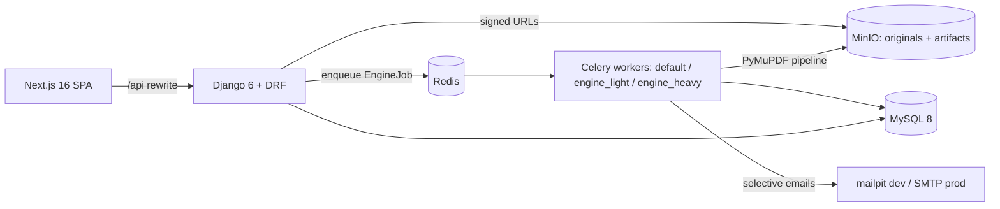

# Architecture — Versiona

> Memory Bank core file. Detailed design: `docs/plan/02-modelo-datos.md` (entities +
> invariants I1–I15), `docs/plan/03-backend.md` (apps, endpoints, roles),
> `docs/plan/04-frontend.md` (screens, state), `docs/plan/05-motor-comparacion.md`
> (engine pipeline + D5 algorithm).

## System shape

- **Bounded contexts** (each a Django app, 14): core, accounts, orgs, projects,
  documents, reviews, observations, checks, comparisons, engine, notifications,
  billing, audit, public_tools (anonymous AllowAny surface, It9).
  El task de análisis coordina checks, comparaciones, sellos y observaciones a
  través de sus servicios; la extracción y persistencia de snapshots quedan
  separadas de esa coordinación.
- **Conventions**: FBV `@api_view` + services layer; triple serializers; `public_id`
  (UUIDv7) in routes; non-members get 404 (I12); DRF pagination 25.
- **Immutability spine**: DocumentVersion frozen once analyzed (I2/I3); Seal +
  SealValidityRecord append-only (I4); seal validity = unbroken chain of `preserved`
  records (I11); D5 conservative bias (I7).
- **Runtime**: native processes on the VPS (no Docker — DP-21). MySQL/Redis/MinIO/
  mailpit as system services; gunicorn+systemd at staging deploy time (deferred).

## Current workflow (updated per iteration)

**Ronda coordinada — 2026-10-08:** los códigos de respaldo y recuperación se
consumen desde filas vigentes bloqueadas; contraseña y código comparten la
transacción. El polling público tiene identidad de carga y cancelación de
transporte/timer al cambiar de página. Las comparaciones públicas conservan su
referencia cuando falla la eliminación de archivos y la siguiente purga puede
reintentar sin detener las demás filas. La navegación compartida adapta su
presentación en celular/tableta y mantiene los mismos destinos por rol. Papelera
precarga autor y contexto para evitar consultas por fila. QA registra la
combinación de los PR antes de integrar; no cambia el árbol desplegado.

**It0 (bootstrap) — DONE 2026-07-12**: services provisioned (database, MinIO +
`versiona-media` bucket, mailpit), Huey→Celery (static beat schedule),
FileSystem→S3-when-bucket-set, monolith split into bounded contexts
(auth preserved in `accounts`, StagingPhaseBanner in `core`), fresh 0001 migrations,
demo e-commerce purged on both sides, Versiona landing + `components/ui` kit,
deterministic PDF fixtures (`testdata/`), flow-definitions v2.0.0, CI on MySQL services.
Backend suite: 123 tests green; frontend: 114 tests green.

**It1–It8 — DONE 2026-07-12** (see `docs/audit/05-cierre.md`): document core (C1-C3,
B1), comparison engine + star screen (E1), Ed25519 seals + selective invalidation D5
(the jewel), collaborative review (D1-D3), mandatory OCR (ocrmypdf+tesseract-spa),
governance (B3/E3), onboarding wow + invitations + TOTP 2FA (A1-A3), monetization
limits + certificates + saved comparisons + org audit (F1-F3, E2, E4), hardening +
the 16-step master journey. 19 flows E2E green.

**It9 (freemium go-public prep) — DONE 2026-07-22**: `billing.Subscription` 14-day Pro
trial auto-started on signup with lazy `effective_plan` (console override > trial >
free) + daily notice beat; public catalog `GET /api/public/plans/`; new bounded-context
app `public_tools` for the anonymous comparator (`/api/public/comparisons/`, ephemeral
MinIO files, 24h TTL results, per-IP throttles, no OCR → upsell); frontend public
surfaces: landing revamp with dual CTA, /precios (live catalog + static fallback),
/comparar + shareable result page, TrialBanner, reusable UpgradeDialog on the three
402 sites; flow contract v2.2.0 (36 flows); CI green (OCR system deps, mailpit
service, quality-gate parser fixes).

**Ronda de mantenimiento — 2026-09-30:** el historial de versiones carga autor,
existencia de sellos/revisiones y último resumen válido de checks con anotaciones
específicas del listado, conservando el payload y los fallbacks del serializer.
La limpieza de comparaciones públicas expiradas avanza por claves crecientes en
lotes sin cargar resultados JSON. Proyectos conserva cinco columnas del checklist
en tableta vertical, envuelve filtros y correos largos y mantiene controles
accesibles. El desborde del Header compacto queda para layout. QA validó los
presupuestos y los recorridos de uso sin debilitar los triggers de inmutabilidad.

**Ronda transversal — 2026-10-01:** el acceso Google toma la
identidad exclusivamente de claims verificados, con audience configurado y
correo confirmado. Google y contraseña comprueban el estado vigente de la
cuenta y exigen TOTP antes de emitir JWT. Un desafío firmado no sustituye esa
comprobación al completar el segundo paso; las pantallas de acceso y registro
mantienen el formulario de código hasta que termina.
El análisis confirma sus etapas en el payload privado del job, junto con los
efectos de cada transacción. Un lock por job evita repetir snapshots, checks,
comparación, D5 y anclajes en entregas simultáneas. Parse/OCR quedan fuera del
lock; el resultado público sólo se publica al terminar. Los fallos posteriores
a la persistencia conservan la versión READY. Un trabajo antiguo sin checkpoint
seguro se detiene sin reescribir datos; no se promete entrega única de SMTP.

**Autenticación y purga — 2026-10-02:** también el alias `/api/token/` valida la
admisión y devuelve un desafío TOTP sin crear JWT antes del segundo factor. Las
entradas de autenticación, incluido refresh y habilitar/deshabilitar TOTP,
comparten un presupuesto por IP (`auth`, configurable; 5/min por defecto) antes
de sus efectos. El backend mantiene la caché vigente: el alcance multiproceso y
la identificación de IP detrás del proxy requieren configuración de despliegue.
La purga mantiene versiones → documentos → proyectos y borrados por instancia,
pero pagina cada recorrido por PK con 100 filas y sólo PK/deleted_at. El cursor
avanza antes de borrar, sin alterar contadores ni PROTECT/triggers. El collector
de una raíz y el tiempo total del backlog siguen sin presupuesto certificado.

**Ronda de contraseñas — 2026-10-02:** todas las escrituras de contraseña de la
API de acceso ejecutan la política configurada de Django antes de persistir.
El registro valida contra el usuario todavía no creado; cambio y recuperación
usan el usuario existente para detectar similitud con sus atributos. Recuperación
comprueba primero la vigencia del código y sólo lo consume tras aceptar la
contraseña. Cambio comprueba primero la contraseña actual. Los errores conservan
el contrato HTTP 400 con texto, sin alterar los validadores de settings.
En esa ronda, los diagnósticos de observaciones y reporte conservaron sus
endpoints y las cadenas D5. La ronda de carga descrita abajo aplica las mejoras
posteriores; la paginación del payload del reporte sigue pendiente.

**Ronda de carga de documentos — 2026-10-02:** la emisión de uploads aplica la
cuota por usuario mediante `UserRateThrottle`, conservando las capacidades ya
emitidas. El reporte combina dos proyecciones SQL; el predicado I11 compartido
comprueba enlaces preservados para versiones vivas reales, sin materializar
historia ni exigir eslabones para números consumidos o versiones en papelera.
Observaciones usa resúmenes, páginas de 25 y fragmentos SQL de 8192 caracteres
Unicode para cuerpos y coordenadas. El store cancela peticiones por generación;
respuestas, historial y contenido se solicitan desde controles explícitos. El
visor histórico conserva el hilo en la URL; las versiones en papelera conservan
su contenido y no ofrecen un enlace inutilizable. El contrato anterior anidado
se sustituye coordinadamente en API/UI, sin nuevas migraciones ni dependencias.
La evidencia de QA y entrega se conserva en el reporte de esta ronda del toolkit.

**R2 — 2026-10-08:** la promoción escribe la captura validada mediante el
backend de almacenamiento existente. La bandeja usa pertenencia vigente y no
elimina evidencia histórica. D5 selecciona sellos válidos mediante I11 y usa
la fila de versión como mutex del plan; todas las elecciones se validan antes
de cambios o correo. `apply_invalidation(..., analysis_degraded=False)` acepta
la señal interna verificada por el motor, sin cambiar el contrato público.
Las confirmaciones repetidas conservan el rechazo 404 existente.

El publicador asíncrono actúa después del commit. Un trabajo pendiente sin ACK
conserva su intención y se recupera por la tarea periódica; un UUID estable y
los checkpoints mantienen efectos únicos ante entregas duplicadas. La espera
de sockets se limita localmente, sin certificar un tiempo total HTTP. SMTP usa
`DJANGO_EMAIL_TIMEOUT`, entero positivo con default 5 segundos. No hay nuevas
migraciones ni dependencias. La preparación de metadatos documentales y
secciones conserva los helpers de autorización y los payloads; la página PDF
y sus resaltados comparten ancho efectivo de contenedor.

**Next**: operator-gated go-public items — deployment (DP-21), domain+SMTP (DP-22),
Ed25519 key rotation/custody (DP-24), Wompi checkout keys (F1 payment leg), optional
It10: public certificate verification (/verificar + QR).
